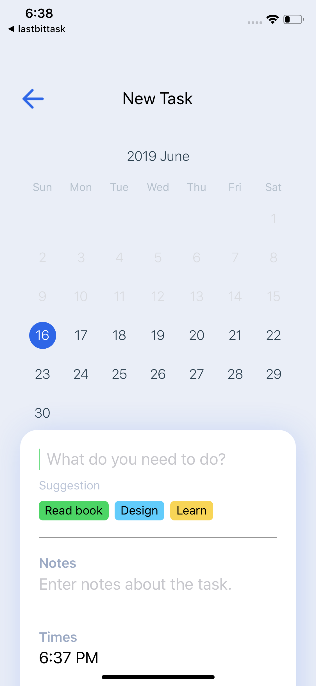
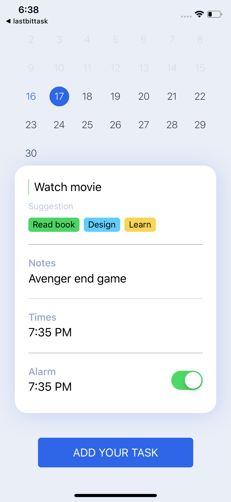
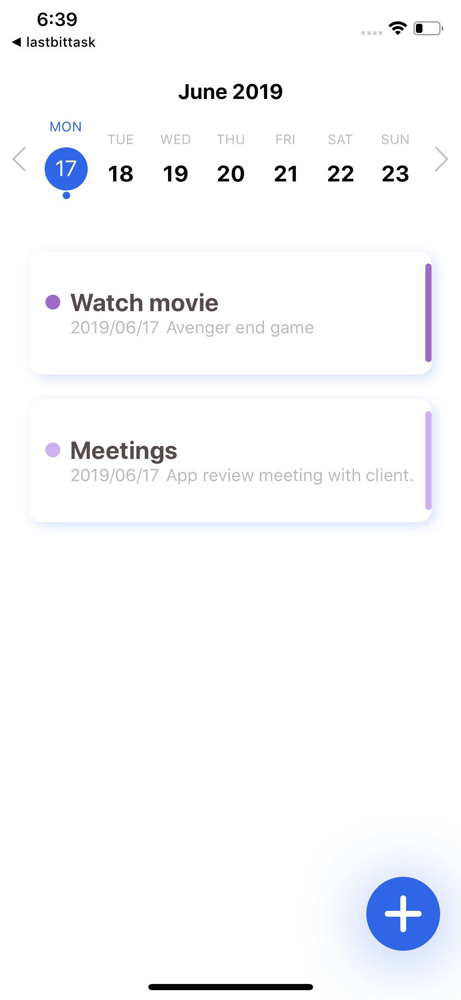
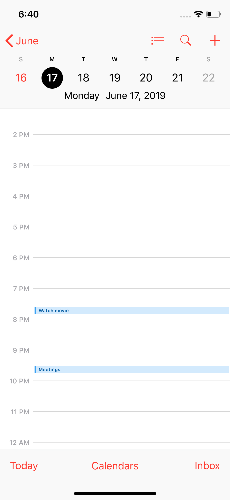

## calendar Event App

This app will save your calendar event in your native iOS and android calendar.

- build using [expo](https://expo.io).

## Getting Started

### Installation

```
yarn install
```

## Video

<div align="center">
  <a href="https://www.youtube.com/watch?v=cXvFcI8FxdA"></a>
</div>

### Screenshots

<p align="center">
  
  
  
  
  
</p>
